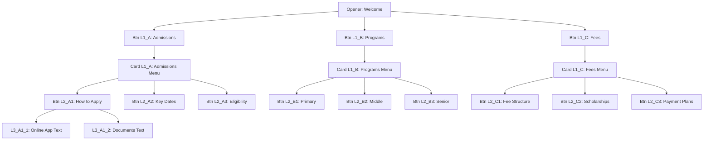

# Recursive Menu Flow (Conversation Flow) Implementation Plan

Enable a branching DM experience where users can create nested "Response Cards". A button in one message can trigger another message, which itself can have buttons.

## User Review Required

> [!IMPORTANT]
> **Scalability vs. Limit (39 Routes):**
> - **Total Routes:** The user provided a map of 39 specific routes (L1_A to L3_C3_3).
> - **Card Constraint:** Since there is a hard **11-card total limit**, not every route can have a unique DM *simultaneously* in one automation if they exceed 11.
> - **The Hierarchy:**
>   - **Level 1 (Menus):** 3 Cards (Admissions, Programs, Fees)
>   - **Level 2 (Menus):** 9 Cards (How to Apply, Primary, Fee Structure, etc.)
>   - **Level 3 (Answers):** Plain Text (doesn't count towards card limit if handled as simple text replies).
> - **Card Numbering:** We will use the provided notation: **L1_A**, **L2_A1**, **L3_A1_1**, etc., to label the cards and buttons.

## Proposed Changes

### Data Model & Types

#### [MODIFY] [automation.ts](file:///c:/QuickRevert/app.quickrevert.tech/src/types/automation.ts)
- Update `ActionButton` to store a `targetCardId` or similar reference.
- Update `SendDmAction` to hold an array of `nestedCards` or use a recursive `childAction` structure that supports multiple children (currently it's 1:1).

### UI Components

#### [MODIFY] [ActionConfig.tsx](file:///c:/QuickRevert/app.quickrevert.tech/src/components/automation-steps/ActionConfig.tsx)
- **Recursive Card Component:** Extract the "Response Card" into a separate sub-component that can render itself recursively up to Level 2.
- **State Management:** Tracking which button points to which card in the flat `nestedCards` array.
- **Visual Connectors:** Implement the "1", "1.1", "1.1.1" numbering system.

### Backend / n8n Integration (Future Step)

#### [MODIFY] [create-workflow/index.ts](file:///c:/QuickRevert/app.quickrevert.tech/supabase/functions/create-workflow/index.ts)
- Update the workflow generator to traverse the tree and create the required `Switch` nodes and `Insta DM` nodes in n8n.

## Tree Visualization (School Admissions System)

## Proposed Changes

### Data Model & Types

#### [MODIFY] [automation.ts](file:///c:/QuickRevert/app.quickrevert.tech/src/types/automation.ts)
- **Flattened Card Store:** Instead of deep nesting (which breaks @ 3 levels), `SendDmAction` will contain a `conversationCards[]` array.
- **Button Payloads:** Each button will store a `payload` matching the route keys (e.g., `L2_A1`).
- **Card ID mapping:** Cards will have an `id` matching their payload (e.g., Card with `id: "L1_A"`).

### UI Components

#### [MODIFY] [ActionConfig.tsx](file:///c:/QuickRevert/app.quickrevert.tech/src/components/automation-steps/ActionConfig.tsx)
- **Breadcrumb Navigation:** Since 11 cards won't fit on one screen vertically, add a "Flow Overview" sidebar or Breadcrumbs.
- **Limit Tracker:** A persistent `Count: 5/11` indicator.
- **Level Constraint:** Automate the "L3" rule—once a button is added to an L2 card, it defaults to a "Text Answer" skip logic rather than a full new card if the limit is tight.

## Verification Plan

### Manual Verification
- Create a 3-level deep flow in the UI.
- Verify that adding a 4th level is disabled/restricted.
- Verify that labels like "Response to 'Btn Label'" are accurate.
- Switch between Millennial and GenZ themes to ensure visual consistency.
